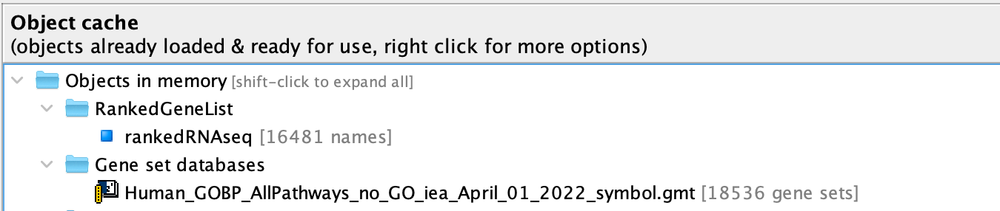
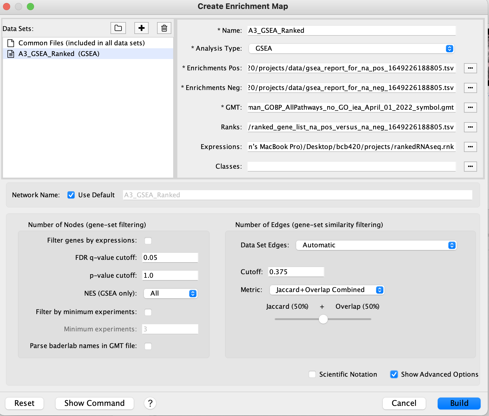

## Table of Contents 
##### Review of Assignment 1 and 2  
##### Download required Packages
##### Non-thresholded Gene set Enrichment Analysis 
##### Visualizing Gene Set Enrichment Analysis in Cytoscape 
##### Interpretation of the annotated network 
##### Post Analysis
######  Citations

Link to the journal for A3 :https://github.com/bcb420-2022/Jiyun_Won/wiki/A3:-Data-Set-Pathway-and-Network-Analysis


### Intro / Review of Assignment 1 and 2  
Expression Data set: GSE84054 
link to the GEO page: https://www.ncbi.nlm.nih.gov/geo/query/acc.cgi?acc=GSE84054

In Assignment 1, the expression data set was read as a dataset in order to filter and normalize. This procedure was completed to have a sorted and simplified dataset for the analysis conducted in assignment 2 and 3. 

In Assignment 2, differential gene expression analysis was conducted to identify the mahor up and downregulated pathways. The result demonstrated that both up and down regulated group were mainly associated with metabollic processes. This will be further explored in A3 using non-thresholded analysis and visualization using cytoscape. 

### Download required Packages

```{r}

if (! requireNamespace("biocManager", quietly = TRUE)){
  install.packages("BiocManager", repos = "http://cran.us.r-project.org")
}
if (!requireNamespace("knitr", quietly = TRUE))
  BiocManager::install("knitr")

if (!requireNamespace("GSA", quietly = TRUE))
  BiocManager::install("GSA")

if (!requireNamespace("RCurl", quietly = TRUE))
  BiocManager::install("RCurl")

```

### library 
```{r}
library(BiocManager)
library(GSA)
library(RCurl)
library(knitr)
library(data.table)
```

### Non-thresholded Gene set Enrichment Analysis 
## gene set 
```{r}
# code retrieved from lecture slide
options(timeout = 1000)
gmt_url = "http://download.baderlab.org/EM_Genesets/current_release/Human/symbol/"
# list all the files on the server 
filenames = RCurl:: getURL(gmt_url)
tc = textConnection(filenames)
contents = readLines(tc)
close(tc)
# get the gmt that has all the pathways and does not include terms inferred 
# from electronic annotations(IEA) start with gmt file that has pathways only
rx = gregexpr("(?<=<a href=\")(.*.GOBP_AllPathways_no_GO_iea.*.)(.gmt)(?=\">)", contents, 
    perl = TRUE)
gmt_file = unlist(regmatches(contents, rx))
dest_gmt_file <- file.path("~/Desktop/bcb420/projects", gmt_file)
download.file(paste(gmt_url, gmt_file, sep = ""), destfile = dest_gmt_file)
``` 

## Sort by rank

# Necessary codes from A1 and A2
```{R}
### From a1
nor_count <- read.table(file ="GSE84054_RLDNormalizedCount_12patientER.txt.gz", header = TRUE)

dt_type <- data.frame("Type"=1:24)
for (type1 in 1:12){
  dt_type$Type[type1] = "Primary Tumour"
}
for (type2 in 13:24){
  dt_type$Type[type2] = "Sphere"
}
rownames(dt_type) <- colnames(exp)[2:25]
### 

type_map <- nor_count[,3:ncol(nor_count)]
rownames(type_map) <- nor_count$EnsemblGeneID
colnames(type_map) <- rownames(dt_type)

plotMDS(type_map, labels = rownames(dt_type), 
        col = c("red", "blue")[factor(dt_type$Type)], 
        main = "MDS Plot - cell type")
```
```{r}
modelDesign <- model.matrix(~ dt_type$Type)
head(modelDesign)
```
```{r}
expressionMatrix <- as.matrix(nor_count[, 3:ncol(nor_count)])
rownames(expressionMatrix) <- nor_count$EnsemblGeneID
colnames(expressionMatrix) <- colnames(nor_count)[3:ncol(nor_count)]
minimalSet <- ExpressionSet(assayData = expressionMatrix)
```

```{r}
fit <- lmFit(minimalSet, modelDesign)
#Apply empirical Bayes to compute differential expression
fit2 <- eBayes(fit, trend = TRUE) # trend=TRUE specific to RNA-seq data
```

```{r}
topfit <- topTable(fit2, coef = ncol(modelDesign), 
                   adjust.method = "BH", 
                   number = nrow(expressionMatrix))
# merge hgnc names to topfit table 
output_hits <- merge(nor_count[,1:2], topfit, by.y = 0, by.x = 1, all.y = TRUE)

# sort by p-value 
output_hits <- output_hits[order(output_hits$P.Value), ]
```
```{r}
### From a1
if (!file.exists("GSE84054_Rawcount_12patientER.txt.gz")){
  GSE84054 <- GEOquery::getGEOSuppFiles('GSE84054')
}
fnames = rownames(GSE84054)
exp <- read.delim(fnames[2], header=TRUE, check.names = FALSE)
cpms = edgeR::cpm(exp[, 2:25])
keep = rowSums(cpms > 1) >= 3 # Dataset of 3 samples per group 
filtered_exp <- exp[keep,]
mart <- biomaRt::useMart("ensembl", dataset = "hsapiens_gene_ensembl")
map_exp <- biomaRt::getBM(filters = "ensembl_gene_id", attributes = c("hgnc_symbol", "ensembl_gene_id"), values = filtered_exp[1], mart = mart)
copy_filter <- filtered_exp
copy_filter <- merge(map_exp, copy_filter, by.x = 2, by.y = 1, all.y = TRUE) 
### 

mat <- as.matrix(copy_filter[,3:26])
rownames(mat) <- copy_filter$ensembl_gene_id
d = edgeR::DGEList(counts = mat, group = dt_type$Type)
# estimate Dispersion 
d <- estimateDisp(d, modelDesign)
```
```{r}
fit <- edgeR::glmQLFit(d, modelDesign)
qlf.pos_vs_neg <- edgeR::glmQLFTest(fit, coef = 'dt_type$TypeSphere')
head(qlf.pos_vs_neg)

#get all the results 
qlf_output_hits <- topTags(qlf.pos_vs_neg, sort.by = "PValue", n = nrow(nor_count))

# merge gene names with the top hits 
qlf_output_hits_withgn <- merge(filtered_exp[,1:2], qlf_output_hits, by.x = 1, by.y = 0)
head(qlf_output_hits_withgn)
```

# Sort by rank
```{r}
# Lecture 7 
df <- output_hits[output_hits$EnsemblGeneID %in% qlf_output_hits_withgn$Var.1,]

pVal <- df$P.Value
lFC <- df$logFC
df[,"rank"] <- log(pVal, base = 10)*sign(lFC)
df <- df[order(df$rank),]
write.table(x=subset(df, TRUE, c(symbol, rank)),
            file="rankedRNAseq.rnk", sep = "\t", 
            row.names = FALSE, col.names = FALSE, quote = FALSE)
```

## Gene Set Enrichment Analysis 
1. What method did you use? What genesets did you use? Make sure to specify versions and cite your methods.

From many different gene set enrichment analysis tools, GSEA is used to conduct this analysis. GSEA (version 4.2.3) is downloaded as an application for the most up-to-date access to the tool and friendly GUI. 
The bader lab gene set and ranked geneset are used to run GSEA. Bader lab dataset is downloaded and ranked gene set are computed as above. These datasets are loaded on to the GSEA application. 

Then, I ran GSEA Pre-Ranked after adjusting the parameters as:
  * Number of Permutations: 1000
  * No_Collapse 
  * Max Size: 200 
  * Min Size: 15

2. Summarize your enrichment results

Overall Report: file:///Users/karenwon/gsea_home/output/apr06/my_analysis.GseaPreranked.1649226188805/index.html

* After running the analysis with max and min limit of 200 and 15, 13149 gene sets were filtered out with the remaining 5387 used in the analysis. 
* The report is specified in two features, gene sets upregulated in phenotype na_pos and gene sets upregulated in phenotype na_neg. 

* na_pos
  * 3894 out of 5387 gene sets 
  * 1369 gene sets are significant at FDR < 25%
  * 497 gene sets are significantly enriched at nominal pvalue < 5% 
  * Detailed snapshot of enrichment results: file:///Users/karenwon/gsea_home/output/apr06/my_analysis.GseaPreranked.1649226188805/pos_snapshot.html
  

* na_neg
  * 1493 out of 5387 gene sets 
  * 794 gene sets are significantly enriched at FDR < 25%
  * 681 gene sets are significantly enriched at nominal pvalue < 5% 
  * Detailed snapshot of enrichment results: file:///Users/karenwon/gsea_home/output/apr06/my_analysis.GseaPreranked.1649226188805/neg_snapshot.html
  


## Compare to A2 
In A2 the thresholded analysis was conducted using g:profiler. According to the result, both up regulated and down regulated terms that were shown to be the major role were both relevant to metabollic processes. However, although the doenregulated group seem tobe similar, the non-thresholded analysis conducted using GSEA seem to demonstrate immune response related major terms for upregulated set. The two analysis indicates that the disease consist of interaction of both immune response and metabolic degradation which supports the paper and present its association with breast cancer. 


### Visualizing Gene Set Enrichment Analysis in Cytoscape 
## Create an enrichment map 
The Enrichment Analysis result is visualized using the tool Cytoscape which presents the connection of genesets in common with edges and nodes. 
The Enrichment Map[@Enrichment] application is downloaded within the Cytoscape platform to easily use GSEA analysis result files. 

The parameter settings to create an enrichment map are set as the image below: 
* FDR Q-Value: 0.05
* P-value: 1.0 
* Edge Cutoff: 0.375


Initial enrichment map creation as an image: 

There are 1170 Nodes and 7142 edges presented in this map. 

## Annotate your network 
The AutoAnnotate[@Autoannotate] application is used to annotate the network. 
The settings are adjusted as the image below: 

The creation of annotation set will then create clusters of nodes indicating the frequency. 
We could see that there are a few large clusters of connected gene sets at the top of the map and several small clusters in the surroundings of the large sets. 
There are seperate genesets presented vertically at the bottom of the map. 

## Edit the map for visualization 
To Improve the presentation of the map the FDR cutOff is restricted further to 0.01. 
This results in 646 Nodes and 33395 Edges. 
The map after auto annotate result in much simpler diagram. 

To further organize and improve the presentation of the map, the "prevent cluster overlap" option is selected when setting up the auto annotate parameters. 

Then, the resulting map is the image below: 

# Publication ready figure / Collapse network to a theme network 
The Enrichment Map is simplified with major theme clusters. Some largest themes include Immune Regulation immunity, Immune Response cell, Regulation cell differentiation, and apc g1 degradation. There seem to be no clear novel pathways. 


### Interpretation of the annotated network 
1. Do the enrichment results support conclusions or mechanism discussed in the original paper? How do these results differ from the results you got from Assignment #2 thresholded methods?

According to the map the up-regulated genes reveal the most interaction with the immune response cell and it is connected to other major themes such as immune regulation, regulation cell differentiation, inferon gamma negative, etc. 
These main terms support the conclusion of the original paper as the immune system cells induces the regulation of the cancer growth. 
As high Immunoglobuline (IG), cancer-derived Ig are known to be present in cancer cells including carcinomas of breast, this also supports the reason why the major terms are present in the map and justifies the original paper. 
The major down-regulated term demonstrated in the map is the APC degradation. The APC plays a role in suppressing a tumor so the degradation suggests that the suppressor is inadequate in preventing the cancer cell growth. 
These similar terms (such as immune response) were also predicted using g:profiler in A2. Therefore, we can conclude that the major causation of the disease in this case is due to immune response malfunction. 

2. Can you find evidence, i.e. publications, to support some of the results that you see. How does this evidence support your result? 

Research paper that support the result concluded in this study could be (Nestler et al., 2022) The paper states that the pathways relevant to immune system processes are highly visible and that most of the differentially expressed genes are also the immune related. Therefore concluded that the role of immune processes are significant in tumours. Another paper (Jin et al., 2021) adds to the evidence that their study revealed the immune cells (specifically TME immune cell in this case) functionally affected the progression of breast cancer. THe paper suggests that the TME of breast cancer is involved in multiple immunosuppression, which interacts with tumor cell metastasis. 

### Post Analysis 
# Add a post analysis to your main network using specific transcription factors, microRNAs or drugs. Include the reason why you chose the specific miRs, TFs or drugs (i.e publications indicating that they might be related to your model). What does this post analysis show?

The publication specifically explored the Pacritinib treatment as an actionable drug target in breast cancer. The ability of this drug was tested to research its potential inhibiting on tumour deriving cells. Therefore, I intended in adding a post analysis on this drug's association with the network. However, the bader lab drug gene set does not contain this main drug that the original paper researched so another drug being discussed in the paper, gemcitabine, was chosen to be focused on. The paper states that the "patients were administered gemcitabine and carboplatin (not in bader lab drug set) for a maximum of siz cycles and patients stopped the treatment if they were deemed to have disease progression."  Therefore, we know that the drug was used for treatment id the cancer did not progress further. However, according to the post analysis, unlike the expectation, the Gemcitabine seem to have no connection in the disease pathway. Gemcitabin function to prevent fast-progressing cancer cell by targeting cell proliferation positive but this was not observed in the post analysis conducted. 


### Citation 

Cui, M., Huang, J., Zhang, S., Liu, Q., Liao, Q., &amp; Qiu, X. (1AD, January 1). Immunoglobulin expression in cancer cells and its critical roles in tumorigenesis. Frontiers. Retrieved April 7, 2022, from https://www.frontiersin.org/articles/10.3389/fimmu.2021.613530/full 

Disis, M. L. (2010, October 10). Immune Regulation of cancer. Journal of clinical oncology : official journal of the American Society of Clinical Oncology. Retrieved April 7, 2022, from https://www.ncbi.nlm.nih.gov/pmc/articles/PMC3041789/ 

Goh, J. Y., Feng, M., Wang, W., Oguz, G., Yatim, S. M. J. M., Lee, P. L., Bao, Y., Lim, T. H., Wang, P., Tam, W. L., Kodahl, A. R., Lyng, M. B., Sarma, S., Lin, S. Y., Lezhava, A., Yap, Y. S., Lim, A. S. T., Hoon, D. S. B., Ditzel, H. J., … Yu, Q. (2017, September 25). Chromosome 1q21.3 amplification is a trackable biomarker and actionable target for breast cancer recurrence. Nature News. Retrieved April 7, 2022, from https://www.nature.com/articles/nm.4405 

Jin, J., Li, Y., Zhao, Q., Chen, Y., Fu, S., &amp; Wu, J. B. (2021, May 6). Coordinated regulation of immune contexture: Crosstalk between STAT3 and immune cells during breast cancer progression - cell communication and signaling. BioMed Central. Retrieved April 7, 2022, from https://biosignaling.biomedcentral.com/articles/10.1186/s12964-021-00705-2 

Nestler, T., Dalvi, P., Haidl, F., Wittersheim, M., von Brandenstein, M., Paffenholz, P., Wagener-Ryczek, S., Pfister, D., Koitzsch, U., Hellmich, M., Buettner, R., Odenthal, M., &amp; Heidenreich, A. (2022, January 12). Transcriptome analysis reveals upregulation of immune response pathways at the invasive tumour front of metastatic seminoma germ cell tumours. Nature News. Retrieved April 7, 2022, from https://www.nature.com/articles/s41416-021-01621-5 

Steipe, B., & Isserlin, R. (Edited). (2022). R-basics https://bcb420-2022.github.io/R_basics/

Ruth Isserlin, Course Lectures (2022)
